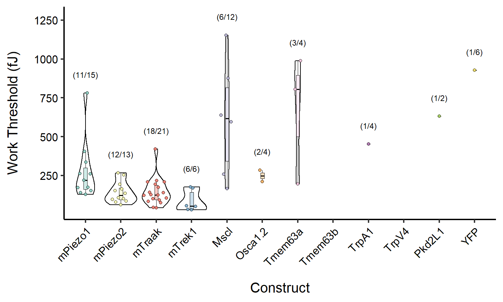

Summary Plots
================

This markdown document goes over how summary plots are constructed from
a table containing aggregate data.

## Load File

The code below will load the aggregate data file and create an ordered
list of factors from the constructs present.It also creates a list of
names associated with each channel of interest that will later be
mappepd onto these factors for plot aesthetics.The data is then triaged
into a new dataframe called dat\_triage based on having a seal quality
\> 300 Megaohms, a peak current greater than 150 pA.The mTraak and
mTrek1 data are not subjected to this since recordings were made at 0 mV
and the seal quality at the time of a given sweep cannot be reliably
assessed. Finally, some aggregate functions are applied to the triaged
dataset.

``` r
library(tidyverse)

dat <- read.csv('agg_bychannel.csv', header=TRUE)
dat$construct <- factor(dat$construct,levels=  c('mp1','mp2','mtraak','mtrek1','mscl','osca12',
                                                 'tmem63a','tmem63b','trpa1','trpv4','pkd2l1','yfp'),
                        ordered = T)

names = c('mPiezo1','mPiezo2','mTraak','mTrek1','Mscl','Osca1.2','Tmem63a','Tmem63b','TrpA1','TrpV4','Pkd2L1','YFP')

dat_triage <- subset(dat, construct %in% c('mtraak','mtrek1') | seal >= 0.3)
dat_triage$wthresh[dat_triage$peaki<150]=NA
sem <- function(x) sd(x)/sqrt(length(x))

dat1 <- dat %>% 
  filter((construct %in% c('mtraak', 'mtrek1')) | (seal >= 0.3)) %>%
  filter(peaki > 150) %>%
  group_by(construct) %>%
  summarize(n = length(wthresh),
            mean = mean(wthresh, na.rm=T),
            sem = sem(wthresh),
            max = max(wthresh, na.rm=T))

dat2 <- dat %>% 
  filter((construct %in% c('mtraak', 'mtrek1')) | (seal >= 0.3)) %>%
  group_by(construct) %>%
  summarize(ntot = length(wthresh))

agg_dat <- merge(dat2,dat1, all =T)
```

### Subset of triaged Data:

| uniqueID           |     date | construct | cell | protocol | sweep | velocity | kcant | dkcant | osm |
| :----------------- | -------: | :-------- | ---: | :------- | ----: | -------: | ----: | -----: | --: |
| 20190917-1-scan-80 | 20190917 | mtraak    |    1 | scan-80  |     5 |       40 |  0.82 |   0.05 | 332 |
| 20190918-1-scan-80 | 20190918 | mtraak    |    1 | scan-80  |     7 |       40 |  0.86 |   0.05 |   0 |
| 20190918-2-scan-80 | 20190918 | mtraak    |    2 | scan-80  |     9 |       40 |  0.86 |   0.05 | 318 |
| 20190918-3-scan-80 | 20190918 | mtraak    |    3 | scan-80  |    11 |       40 |  0.75 |   0.04 | 321 |
| 20191001-1-scan-80 | 20191001 | mtraak    |    1 | scan-80  |     6 |       40 |  1.03 |   0.06 | 316 |
| 20191001-2-scan-80 | 20191001 | mtraak    |    2 | scan-80  |     6 |       40 |  1.03 |   0.06 | 318 |

### Aggregate data table

| construct | ntot |  n |      mean |       sem |       max |
| :-------- | ---: | -: | --------: | --------: | --------: |
| mp1       |   15 | 11 | 275.71293 |  56.85369 |  780.9153 |
| mp2       |   13 | 12 | 141.54324 |  19.47105 |  267.3789 |
| mtraak    |   21 | 18 | 145.57287 |  20.50905 |  419.2840 |
| mtrek1    |    6 |  6 |  85.43822 |  27.76754 |  175.4537 |
| mscl      |   12 |  6 | 614.30698 | 151.51723 | 1153.6275 |
| osca12    |    4 |  2 | 248.08354 |  36.68369 |  284.7672 |
| tmem63a   |    4 |  3 | 663.10419 | 239.10188 |  987.8130 |
| tmem63b   |    2 | NA |        NA |        NA |        NA |
| trpa1     |    4 |  1 | 452.31677 |        NA |  452.3168 |
| trpv4     |    1 | NA |        NA |        NA |        NA |
| pkd2l1    |    2 |  1 | 631.82208 |        NA |  631.8221 |
| yfp       |    6 |  1 | 927.54818 |        NA |  927.5482 |

## Prepare plot themes and aesthetics

The following code will load the plotting libraries and font libraries
to be used in creating the final plot. It also creates a custom theme
function with starting plot parameters for publication quality figures.

``` r
library(ggplot2)
library(ggbeeswarm)
library(extrafont)
loadfonts(device = "win")

theme_paper <- function(base_size=10,base_family="Arial") {
  library(grid)
  (theme_bw(base_size = base_size, base_family = base_family)+
      theme(text=element_text(color="black"),
            axis.title=element_text(size = 10),
            axis.text=element_text(size = 8, color = "black"),
            legend.position = "none",
            panel.border = element_blank(),
            panel.background = element_blank(),
            axis.line = element_line(colour = "black"),
            panel.grid=element_blank()
      ))
}
```

## Plot Data

The following code will create the final plot of, in this case, Work
Threshold as a function of the expressed construct. The plot is a violin
plot with overlayed individual datapoints and a boxplot of the summary
statistics.

``` r
p1 <- ggplot(dat_triage, aes(x=construct, y=wthresh, fill=construct, colour=construct)) +
  geom_violin(lwd=0.25, fill='white',colour='black')+
  geom_boxplot(color='black',width=0.1,lwd=0.2, alpha=0.4, outlier.shape =NA)+
  geom_quasirandom(shape=21, alpha=0.9, size = 1, stroke=0.25, colour='black', varwidth=T)+
  scale_x_discrete(breaks=c('mp1','mp2','mtraak','mtrek1','mscl','osca12','tmem63a','tmem63b',
                            'trpa1','trpv4','pkd2l1','yfp'), labels = names)+
  scale_colour_brewer(palette='Set3')+
  scale_fill_brewer(palette='Set3')+
  geom_text(data = agg_dat, aes(x=construct, y= max + 0.10*1200, 
                                   label = paste('(',n,'/',ntot,')', sep = "")),size=2, colour='black')+
  scale_y_continuous(breaks=c(250,500,750,1000,1250))+
  xlab("Construct") +
  ylab("Work Threshold (fJ)")+
  theme_paper() +
  theme(axis.text.x = element_text(angle=45,hjust=1),
        axis.title.y = element_text(margin = margin(t = 0, r = 10, b = 0, l = 0)),
        axis.title.x = element_text(margin = margin(t = 10, r = 0, b = 0, l = 0)))
 
p1 
```

<!-- -->

``` r
ggsave('agg_wthresh.pdf', plot=last_plot(), dpi=300, width=5, height=3, units= "in", dev=cairo_pdf)
```
